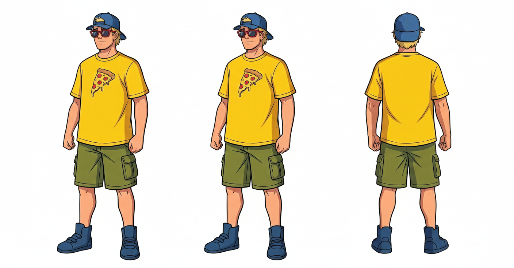
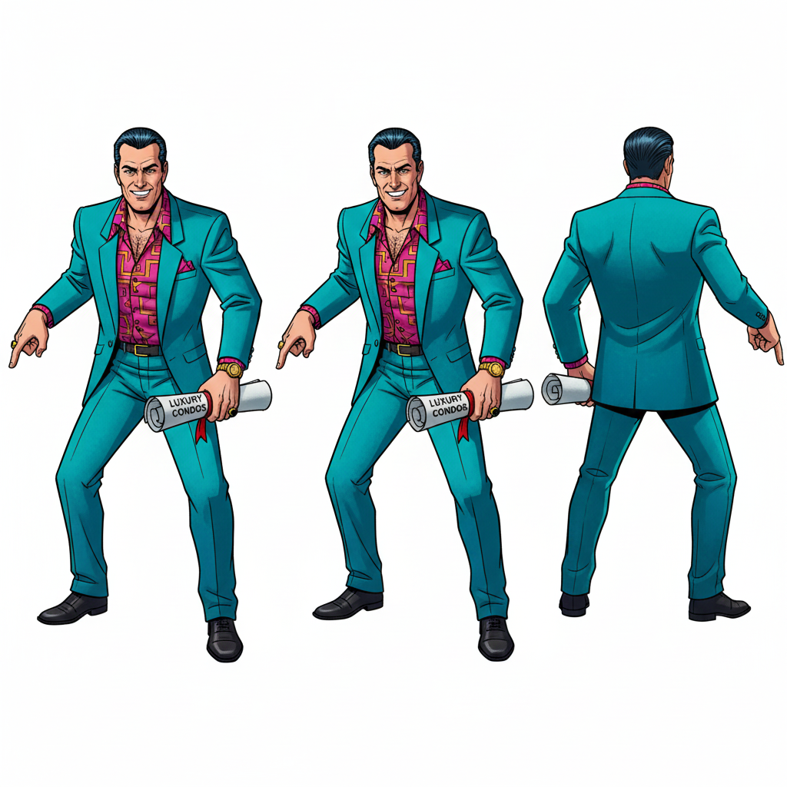
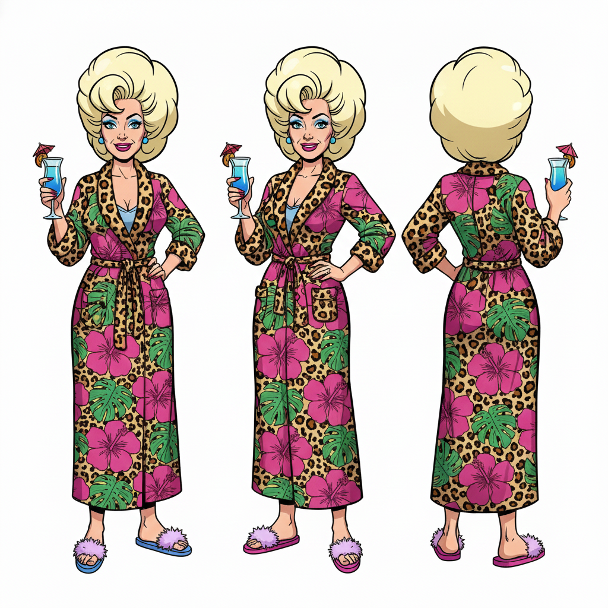

# Character Reference Images

All images are designed in a 1980s G.I. Joe–style for visual reference when browsing on GitHub or GitHub Pages.

## Main Cast

- **Zack – Party-Bro Protagonist**  
  

- **Kyle – Goofy Twin**  
  

## Supporting Characters

- **Daisy – Sharp-Witted Nurse**  
  

- **Delia – Warm, Empathetic Nurse**  
  

- **Rick Vantrell – Sleazy Developer Villain**  
  

- **Brand & Chad – Rival Wakeboard Bros (Two Characters)**  
  .png)

- **Karen – Raunchy Noisy Neighbor**  
  

